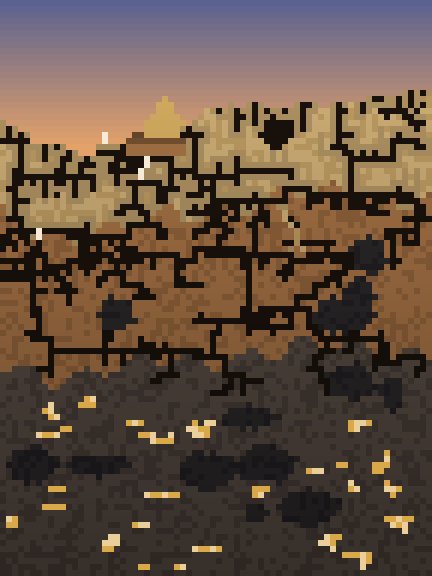

# HOURGLASS

[](https://github.com/Syncrose1/HOURGLASS/actions/workflows/ci.yml)
[](https://github.com/Syncrose1/HOURGLASS/releases/latest)

An on-device productivity timer where every timer is a little world at work. Give a
task twenty minutes and a mining crew sinks shafts for twenty minutes; stay focused and
they get the job done.

<p align="center">
  
</p>

## Worlds, not progress bars

Each timer runs a genuine simulation, not an animation. Nothing is scripted: where the
tunnels go, which tree falls first, whether the castle wall holds — all of it falls out
of the rules, and no two runs are alike. The only thing tied to the clock is how hard
the inhabitants work. A pacer watches progress and nudges effort so that each world
lands at about 85% of its job when the timer runs out, which leaves overtime something
to buy.

The crews are deliberately imperfect. Miners cannot see ore until they tunnel close to
it, give up on drifts that turn up nothing, and have to work round bedrock they cannot
dig. Workers take breaks, and when a world is ahead of the clock the crew sits down for
a while rather than moving in slow motion.

| World | What happens |
|---|---|
| **Mine** | Miners prospect through sand, sandstone and rock, hauling mineral to the cart. Sand slumps into their tunnels; rock does not. |
| **River** | Beavers pull apart a logjam, and the lake behind it drains down the valley. |
| **Colony** | Ants forage from above, laying scent trails that strengthen while a food source pays and fade when it runs out. |
| **Island** | An undersea volcano builds a cone out of the sea, quenching in steam, until it breaks the surface and grass takes hold. |
| **Forest** | A lumber crew fells trees, clears the drop zone before each one comes down, strips and saws the trunks, and carries the lengths in pairs. |
| **Battle** | Two armies contest a valley. Commanders send squads to assault and flank; outnumbered squads fall back; the routed regroup and return. |
| **Harbour** | Ships come and go at a quay. A crane unloads them, dockers fill the warehouse, and now and then a load slips into the water. |
| **Siege** | Masons raise a castle course by course while a trebuchet knocks pieces out of it, and they patch the holes. |

## The ten souls

Every world's crew is cast from the same ten people: Jeb, Mira, Otto, Wren, Bram,
Tilly, Ezra, Nell, Iggy and Pip. Whatever they do is credited to their name under the
role they played — Jeb the Beaver's logs broken, Otto the Crane driver's loads craned
ashore, Tilly the Mason's holes patched — and kept for good on the Souls screen. Each
has a temperament: some work quickly, some carefully, and a careful crane driver really
does drop fewer loads.

## The rest of the app

**One wall, no scrolling.** Every timer is a tile on one screen, sized by how much time
it is given, like a treemap. Add more and the tiles get smaller rather than spilling into
a list — a wall that visibly gets denser is its own argument for having fewer timers.

**One gesture.** Tap a tile and its world fills the screen and the timer starts. Tap again
and it pauses and hands back the wall. Long-press a tile to edit it.

**The day as a sky.** A strip of pixel sky across the top of the wall shows how much of
the day is left: the sun crosses it and sets into the dunes as bedtime comes, and the
stars come out when the day is over. Every world's sky follows the same clock.

**Your day ends in 2 hours 15 minutes.** A standing notification says how much of the
day is left, floored to the quarter hour so it steps rather than ticks, with a line of
encouragement for the morning, afternoon or evening underneath.

**Overtime.** Running past an allocation is a feature, not an error. The clock goes
positive as `+MM:SS`, the world keeps working toward the rest of its job, and the overrun
is recorded against the task. A timer that reaches its allocation says so once, and
stops nothing.

**Quicksand.** Lightweight timers for whatever comes up, deliberately quieter than the
day's real work.

**The desert.** Every finished session pours a band of sand in the timer's colour onto a
dune, oldest at the base, so the pile is a cross-section of how the time was actually
spent.

**A timer that stays put.** A running timer holds an ongoing notification with a live
countdown, pause and stop. The run is journalled, so it survives the app being closed,
killed or the phone restarting.

## Architecture

| Layer | What lives there |
|---|---|
| `core/` | Pure Kotlin with no Android imports: the timer state machine, bedtime arithmetic, treemap layout, the desert, and in `core/world/` every simulation, the crew engine, the pacer, palettes, the souls and the day sky. |
| `data/` | Room entities, DAOs, `HourglassRepository`, and the souls' ledger. |
| `timer/` | `TimerController`, a process singleton that owns the one running timer, ticks it and journals it. |
| `service/` | `TimerService` and the day notification: renderers for state as notifications. |
| `viewmodel/` | Screen state, assembled from the repository and the controller. |
| `ui/` | Theme tokens, the world renderer, tiles, screens and navigation. |

Kotlin, Jetpack Compose, MVVM, Hilt and Room. The simulations are platform-free so they
can be hosted elsewhere.

## Building

```bash
./gradlew assembleDebug        # build
./gradlew testDebugUnitTest    # unit tests, including every world's pacing
./gradlew lintDebug            # Android lint
```

Requires JDK 17 and the Android SDK (compileSdk 34). Minimum device API is 26.

To see the worlds without a phone, render them to PNG:

```bash
WORLDSHOTS_DIR=/tmp/worldshots ./gradlew testDebugUnitTest --tests '*WorldSnapshots*'
```

CI runs build, tests and lint on every push to `main` and every pull request. Pushing a
version tag (`git tag -a v1.2.3 -m "…" && git push origin v1.2.3`) runs the same checks
and publishes a release with an installable APK attached.

## Privacy

All data stays on the device. The app holds no `INTERNET` permission: there are no
accounts, no sync and no analytics.
